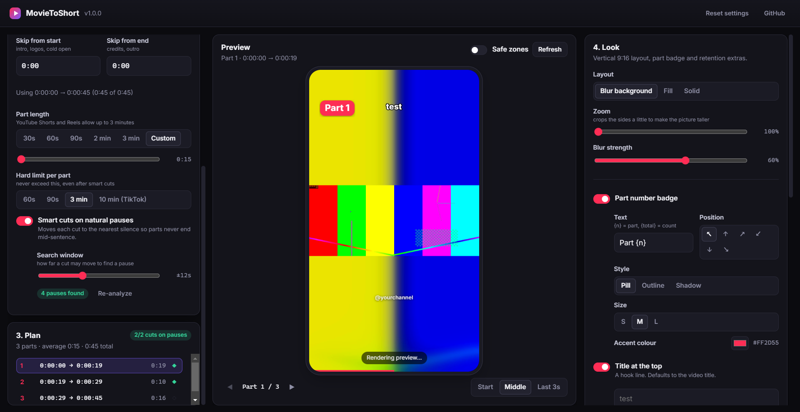

<p align="center">
  
</p>

<h1 align="center">MovieToShort</h1>

<p align="center">
  Turn any long video or YouTube link into numbered, vertical, ready-to-post Shorts and Reels.<br/>
  Free, open source, runs on your own computer. Windows · macOS · Linux.
</p>

<p align="center">
  
</p>

## What it does

1. **Paste a YouTube link or drop a video file** (MP4, MKV, MOV, AVI, WEBM, TS… anything ffmpeg can read).
2. **Skip the intro and the credits** with two time fields.
3. **Split into parts** of 30 s to 3 min. Cuts are moved onto natural pauses so no part ends mid-sentence, and every part is the same length (no 12-second "Part 47").
4. **Render vertical 1080×1920 videos** with a **Part 1, Part 2, …** badge, a progress bar, a "Part N ▶" teaser at the end of each part, an optional title hook and channel watermark.
5. Upload. A `captions.txt` with ready-to-paste titles and hashtags for every part is written next to the videos.

Everything is previewed before you render, at the exact pixels that will be exported.

## Download

Grab the latest installer from the [Releases](../../releases) page:

| Platform | File |
| --- | --- |
| Windows 10/11 | `MovieToShort-<version>-win-x64.exe` |
| macOS (Apple Silicon) | `MovieToShort-<version>-mac-arm64.dmg` |
| macOS (Intel) | `MovieToShort-<version>-mac-x64.dmg` |
| Linux | `MovieToShort-<version>-linux-x86_64.AppImage` |

The builds are not code-signed. On macOS, the first launch needs a right-click → **Open**, or run `xattr -cr /Applications/MovieToShort.app` once. On Windows, click **More info → Run anyway** on the SmartScreen prompt.

YouTube downloads use [yt-dlp](https://github.com/yt-dlp/yt-dlp), which the app downloads on first use into its data folder and can update from the UI (**Age-restricted or private video? → Update yt-dlp**). YouTube changes often; if a link stops working, update first.

## Why the output performs

The defaults come from what actually holds viewers on Shorts, Reels and TikTok:

- **Safe zones.** Badges, titles and watermarks are placed where the platform UI (title, caption, like/share column) does not cover them. Toggle *Safe zones* in the preview to see the covered areas.
- **Even part lengths + smart cuts.** Silence detection (`ffmpeg silencedetect`) finds pauses; the planner spreads parts evenly and snaps each boundary to the best pause within a search window, preferring longer pauses (scene breaks) over short breaths.
- **Progress bar.** A thin bar along the bottom tells viewers the part is almost over, which measurably reduces swipe-away on long clips.
- **"Part N ▶" teaser.** Fades in during the last seconds of every part except the last one.
- **Blurred backdrop by default.** Movies and 16:9 content keep the whole frame; *Zoom* crops a little from the sides to make the picture taller. *Fill* crops to full screen for talking heads; *Solid* pads on a colour.
- **Loudness normalised to −14 LUFS**, true peak −1.5 dB, stereo 48 kHz AAC. Same volume across every part and platform.
- **H.264 High profile, `+faststart`,** source frame rate (capped at 60), CRF quality presets, optional GPU encoding (NVENC, QuickSync, AMF, VideoToolbox) with automatic software fallback.

## Run from source

Requirements: [Node.js](https://nodejs.org) 20 or newer.

```bash
git clone https://github.com/movietoshort/movietoshort.git
cd movietoshort
npm install          # also downloads ffmpeg/ffprobe for your platform
npm run dev          # start the app with hot reload
```

Other scripts:

```bash
npm test                 # unit tests (planner, parsers, helpers)
npm run test:integration # renders real clips with the bundled ffmpeg (no Electron needed)
npm run typecheck
npm run dist:win         # installer for Windows  -> dist/
npm run dist:mac         # dmg + zip for macOS    -> dist/
npm run dist:linux       # AppImage               -> dist/
```

Smoke test the built app without clicking (used by CI):

```bash
npm run build
MOVIETOSHORT_SMOKE=shot.png MOVIETOSHORT_SMOKE_FILE=some.mp4 MOVIETOSHORT_SMOKE_RENDER=1 MOVIETOSHORT_SMOKE_OUT=./out npx electron .
```

## How it works

```
src/
  shared/      types, planner (planParts), time helpers, encoder args   – pure, unit-tested
  main/        Electron main process
    probe.ts        ffprobe → SourceInfo (duration, size, SAR/rotation, audio tracks, thumbnail)
    ytdlp.ts        download/update yt-dlp, fetch info, download (cached per video id)
    silence.ts      silencedetect pass over the audio, streamed progress
    filtergraph.ts  builds the -filter_complex for a part (layout, overlays, progress bar, audio)
    render.ts       renders every part sequentially, writes manifest.json + captions.txt
    encoders.ts     hardware encoder detection (real test encode)
    ipc.ts          IPC handlers, one cancellable job at a time
  preload/     contextBridge API (window.api)
  renderer/    React UI. Overlays (badge, title, watermark, teaser) are drawn on a <canvas>
               at 1080×1920 and sent to ffmpeg as PNGs, so any font/style works on any OS.
```

Per part, ffmpeg runs once with input seeking (`-ss … -t …` before `-i`, frame accurate) and a single filter graph:

```
[0:v] setpts → (fps) → layout (blur | fill | solid) → badge → title → watermark → teaser → progress bar → yuv420p
[0:a] asetpts → loudnorm → 48 kHz stereo
```

The blurred backdrop is computed at quarter resolution and scaled back up, which is 16× cheaper and looks identical.

## Roadmap

Contributions welcome. Things that would make this better, roughly in order:

- [ ] Auto captions (whisper.cpp) burned in with word highlighting
- [ ] Scene-change aware cuts in addition to silence
- [ ] Face/subject tracking for the *Fill* layout
- [ ] Batch queue: several videos in one go
- [ ] Direct upload to YouTube / Instagram via their APIs
- [ ] Custom fonts and badge templates (JSON presets)

See [CONTRIBUTING.md](CONTRIBUTING.md).

## License

MIT. ffmpeg builds are provided by the [ffmpeg-static](https://github.com/eugeneware/ffmpeg-static) package under their respective licenses; yt-dlp is Unlicense; the Inter font is SIL OFL 1.1.

Please respect copyright: only cut and republish content you own or have permission to use.
